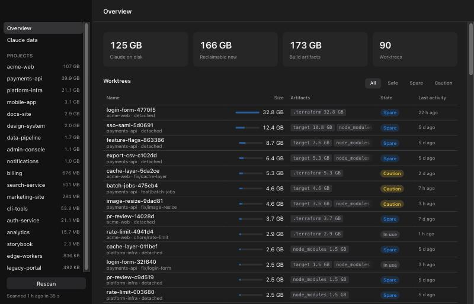

# Claude Storage Cleaner

See where Claude Code's disk usage goes on your Mac, and clean it up without
losing work.



The Claude desktop app gives every coding session its own git worktree under
`<repo>/.claude/worktrees/`. Each worktree re-materialises `.terraform`,
`node_modules`, `target`, `.next` and friends, and nothing removes them when
the session is archived. On the machine this was written on, that added up to
over 100 GB across about 90 worktrees, with a single worktree holding 32 GB of
Terraform providers.

Claude Storage Cleaner lists every project, worktree and session with real
on-disk sizes and a conservative safety state, then offers three actions:

| Action                 | What it does                                                                                    |
| ---------------------- | ----------------------------------------------------------------------------------------------- |
| **Prune artifacts**    | Removes build output and keeps the checkout. The big win, with no risk to commits.             |
| **Remove worktree**    | Removes a clean worktree. The branch is deleted only when every commit is on a remote.          |
| **Forget transcripts** | Drops `~/.claude/projects` folders whose working directory no longer exists.                    |

Every action shows its plan first, moves files to the Trash by default, and
re-checks the live system right before the first step. A worktree with a
running session, a git lock, or work that exists nowhere else is never removed
silently.

## Install

The app is not signed with an Apple Developer ID yet, so whichever way you
install it, macOS will refuse to open it until the quarantine flag is cleared.
One command does that; it is included in each path below. Homebrew removed its
`--no-quarantine` flag in version 5, so it can no longer do this for you.

### Homebrew (recommended)

```bash
brew tap jravas/tap
brew install --cask claude-storage-cleaner
xattr -dr com.apple.quarantine "/Applications/Claude Storage Cleaner.app"
```

Upgrades are `brew upgrade --cask claude-storage-cleaner` followed by the same
`xattr` line. The cask definition lives in
[homebrew/Casks](homebrew/Casks/claude-storage-cleaner.rb).

### Download the DMG

Grab the `.dmg` for your chip from the
[releases page](https://github.com/jravas/calude-storage-cleaner/releases),
drag the app to Applications, then clear the flag once:

```bash
xattr -dr com.apple.quarantine "/Applications/Claude Storage Cleaner.app"
```

Without that step, macOS 15 and later shows "Apple could not verify this app"
and offers no way through from the dialog. The alternative is System Settings
→ Privacy & Security → Open Anyway.

### Build from source

Apps built locally are never quarantined.

```bash
git clone https://github.com/jravas/calude-storage-cleaner.git
cd calude-storage-cleaner
cargo install tauri-cli --version '^2' --locked
cd crates/app && cargo tauri build
open ../../target/release/bundle/macos/Claude\ Storage\ Cleaner.app
```

Requires Rust stable and Xcode command line tools. There is no Node toolchain.

### Why no Developer ID

Signing and notarization need an Apple Developer Program membership. The
release workflow already supports it: set the `APPLE_*` repository secrets
listed in [.github/workflows/release.yml](.github/workflows/release.yml) and
tagged builds come out signed and notarized, with no quarantine step for
anyone. Until then, releases are ad-hoc signed.

## Using the app

- **Overview** shows four numbers: Claude's total footprint, what is
  reclaimable right now, build artifacts everywhere, and the worktree count.
  Below it, every worktree sorted by size.
- **Projects** in the sidebar show one repo at a time with its main checkout
  pinned on top. The main checkout can be pruned but never removed.
- **Claude data** lists transcript folders and well-known caches (the Claude
  app's VM image and web cache, npm, pnpm, Yarn, Puppeteer, Playwright, Docker's
  sparse disk) so you can see what else is large.
- Click a row for the detail pane: path, branch, git facts, sessions, artifact
  breakdown, and the action buttons.

Sizes are what the files occupy on disk, the same way `du` counts them, so
sparse files and clones are not over-reported. A scan of a 400 GB disk takes
about 35 seconds and runs in the background on every launch.

### Safety states

| State       | Meaning                                                                                                      |
| ----------- | ------------------------------------------------------------------------------------------------------------ |
| **In use**  | A Claude process has it as working directory, git has it locked, or it is the main checkout. Not removable.  |
| **Spare**   | The Claude app keeps it in its reuse pool. Prune freely; removing it makes the app create a new one later.    |
| **Caution** | Changed or untracked files, unpushed commits, commits on no remote, a session still open, not created by the app, or modified in the last hour. Removal needs an explicit acknowledgement when work would be discarded. |
| **Safe**    | Clean, every commit is on a remote, no open session.                                                         |

Every executed step is appended to `~/Library/Logs/cleaner-app/actions.log`.

## Command line

The same engine ships as a CLI, useful for scripting or a quick look:

```bash
cargo build --release -p cleaner-core
./target/release/scan                       # table of everything
./target/release/scan --json > report.json
./target/release/scan prune  <worktree> [--permanent] [--yes]
./target/release/scan remove <worktree> [--delete-branch] [--permanent] [--yes]
./target/release/scan forget <transcript-dir>... [--yes]
```

Action subcommands print the plan as a dry run unless `--yes` is given.

## How it works

```
crates/core   cleaner-core: scanners, safety rules, actions, the `scan` CLI
crates/app    cleaner-app: Tauri 2 shell and commands
ui/           index.html, styles.css, app.js, embedded at build time
```

The scanner reads four sources and joins them by canonical path:

1. `~/.claude/projects/**.jsonl` transcripts, streamed line by line for title,
   working directory, branch, timestamps and PR link.
2. The desktop app's session index (`claude-code-sessions/**/local_*.json`)
   and worktree registry (`git-worktrees.json`), read-only.
3. `git worktree list --porcelain`, `git status --porcelain=v2` and
   `git rev-list` per worktree. Never fetches, never prompts.
4. `~/.claude/sessions/*.json` plus a liveness check on each pid, to know what
   is in use right now.

## Development

```bash
cargo test -p cleaner-core
cd crates/app && cargo tauri dev
```

See [CONTRIBUTING.md](CONTRIBUTING.md) for the ground rules. Changes are
tracked in [CHANGELOG.md](CHANGELOG.md).

## License

[MIT](LICENSE)
